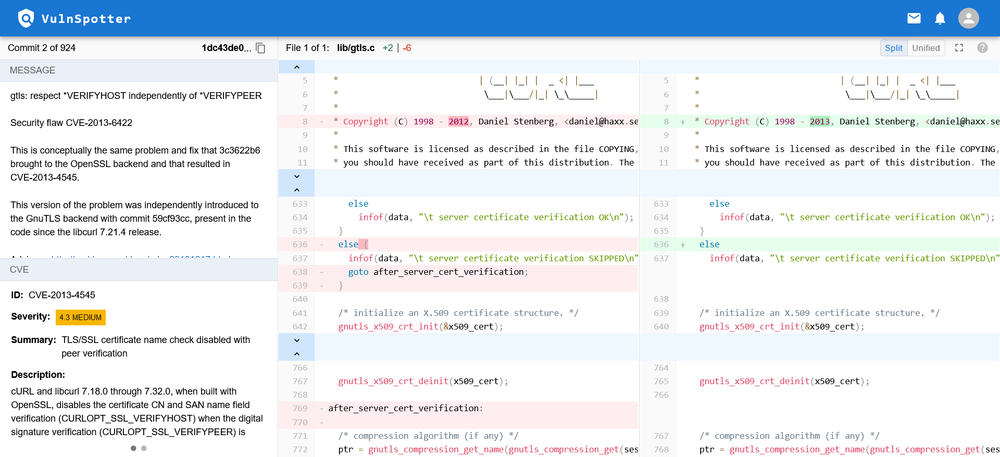
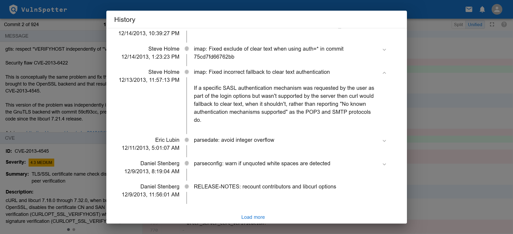

# VulnSpotter

A comprehensive tool designed to identify and analyze commits that address security vulnerabilities in open-source repositories.

## Features

- **Vulnerability Parsing**: 
  - Scans the repository for potentially vulnerable commits using [git-vuln-finder](https://github.com/cve-search/git-vuln-finder) and categorizes them into projects for further review.
  
- **Clear Display of Results**: 
  - The tool presents identified commits in an easy-to-digest manner, detailing:
    - Referenced CVE entries
    - Commit message
    - Commit changes with syntax highlighting
    - Commit history

- **Display Modes**: 
  - View commit changes in two distinct styles:
    - **Unified Mode**: A single diff view with changes.
    - **Split Mode**: Side-by-side comparison of old and new code.

- **Filtering Capabilities**: 
  - Filter commits using specific keywords to narrow down your review process.

- **Review Mechanism**: 
  - Classify commits into various categories:
    - Vulnerable
    - Neutral
    - Safe

- **Export Functionality**: 
  - Export metadata about your reviewed commits for record-keeping or further analysis.

- **Collaborative Review**: 
  - Invite other team members to your project, allowing them to review and classify commits.

## Screenshots

## Installation

The project is split into server-side and client-side components. For a smooth setup:

### Server-Side
Please refer to [SERVER-INSTALL](backend/README.md) for detailed server setup instructions.

### Client-Side
For client setup and configuration, see [CLIENT-INSTALL](frontend/README.md).

Follow the guides accordingly to ensure both components are correctly set up and integrated.

## Acknowledgements

This project is made possible thanks to a myriad of third-party tools and libraries from the open-source community. I extend my heartfelt gratitude to all the developers and contributors whose work has been instrumental in shaping my software.

## License

This project is licensed under the GNU Affero General Public License v3.0 - see the [LICENSE](LICENSE) file for details.

The AGPLv3 is similar to the GPLv3, but additionally ensures that the software running over a network provides the source code to its users. This promotes sharing and modification of the software, even in web-based tools and applications.

